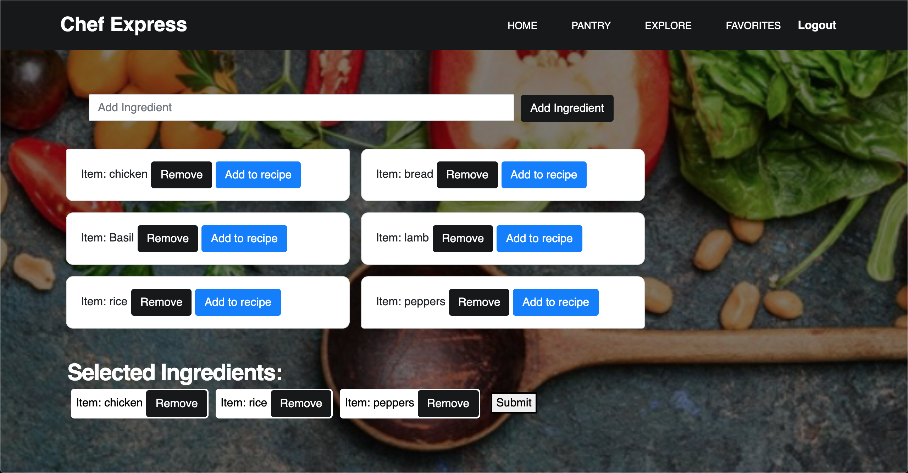
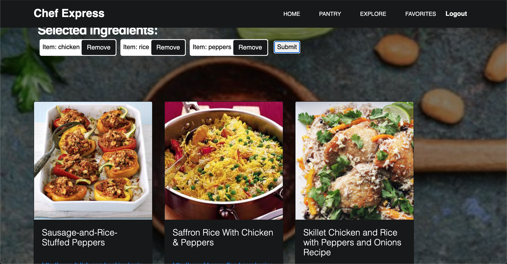
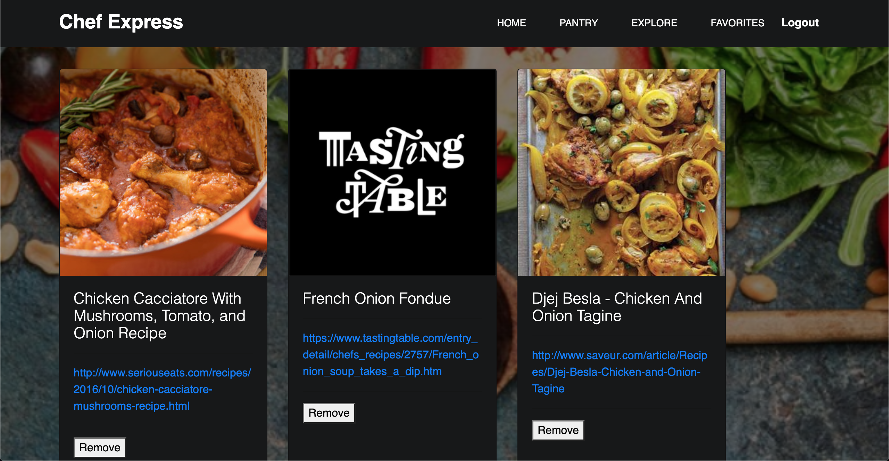

# Project_2

## Description

This is a househould grocery inventory and recipe generation application. This application is focused on creating and maintaining an SQL database with the ability to store the items from your household's "pantry" into a list, and also delete items from that list. The final functional purpose of the application is to be able to select ingredients from your "pantry" and generate a recipe that utilizes said ingredients. There is also an "explore" page that randomly generates different recipes as well as a "favorites" page that lets you save your favorite recipes.

This is our landing page:

This is our pantry page:

These are recipes generated from ingredients in your pantry:

This is your favorites page:

# Questions

For any questions about this assignment, feel free to reach out to the project members on github or email.

https://github.com/dolanpettit

https://github.com/Josephtorres1

simply.joseph00@gmail.com

dolanpettit@gmail.com
